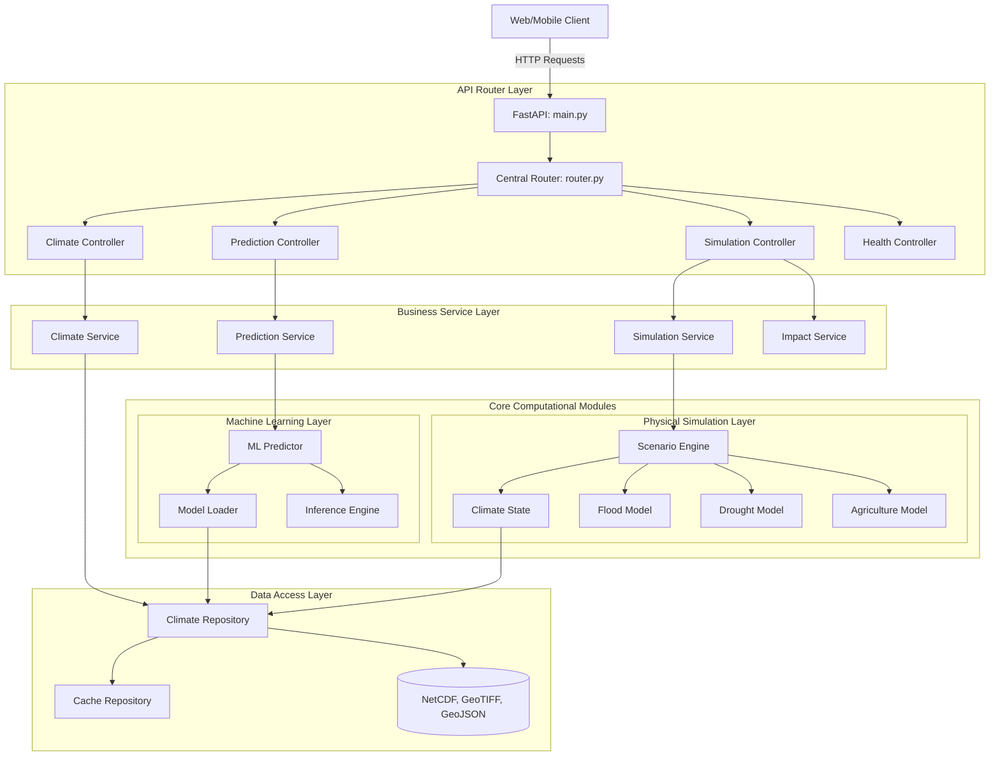

# Climate Digital Twin - Backend Service

This repository houses the FastAPI backend service for the **AI-Powered Digital Twin of India's Climate**, designed and developed for the *Bharatiya Antariksh Hackathon*.

This digital twin simulates regional microclimate scenarios, models multi-hazard environmental risks (floods, droughts, crop stresses), and runs deep learning prediction workflows for precipitation and temperature changes across India using IMD and INSAT data.

---

## Architecture Overview

The backend is built around a layered architecture separating concerns between API Routing, Business Services, Physics-based Simulations, Machine Learning, and Repository (Geospatial/Raster IO) layers.



---

## Directory Structure

```
backend/
├── app/                        # Main application core package
│   ├── main.py                 # FastAPI Application entry point & configuration
│   ├── api/                    # API Controller layer (Endpoints & Request validation)
│   │   ├── router.py           # Master router registering sub-modules
│   │   ├── climate.py          # Historical data and climate metrics endpoints
│   │   ├── prediction.py       # AI Inference execution triggers
│   │   ├── simulation.py       # Multi-scenario digital twin triggers
│   │   └── health.py           # Dependency health status check
│   ├── config/                 # Application configuration schemas
│   │   ├── settings.py         # Pydantic BaseSettings class loading env variables
│   │   └── constants.py        # Domain & environmental configuration constants
│   ├── exceptions/             # Global exception handlers and error classes
│   │   └── handlers.py         # Standardized error formats
│   ├── ml/                     # ML Model orchestrators and loaders
│   │   ├── predictor.py        # ML run orchestrator
│   │   ├── model_loader.py     # Local/Remote model weight loader & memory manager
│   │   └── inference.py        # Low-level mathematical tensor inference wrapper
│   ├── repositories/           # Data access layers (Geospatial data fetchers)
│   │   ├── climate_repository.py  # NetCDF/GeoTIFF ingestion & lookup
│   │   └── cache_repository.py # Redis caching adapters for heavy operations
│   ├── schemas/                # Pydantic data schemas (Request/Response validation)
│   │   ├── climate.py          # Climate requests/metadata schemas
│   │   ├── prediction.py       # Prediction inputs/inference output schemas
│   │   └── simulation.py       # Scenario parameter and spatial layer schemas
│   ├── services/               # Orchestrates business logic and layer integration
│   │   ├── climate_service.py  # Statistical climate aggregates and grid lookups
│   │   ├── prediction_service.py # Preprocesses parameters and triggers AI predictors
│   │   ├── simulation_service.py # Runs physics simulations for scenarios
│   │   └── impact_service.py   # Synthesizes cross-disciplinary risk metrics
│   ├── simulation/             # Physics-based simulation engines
│   │   ├── climate_state.py    # Temporal state representing environmental attributes
│   │   ├── scenario_engine.py  # Mutator running IPCC-like projection steps
│   │   ├── agriculture_model.py # Crop water requirement & vegetation stress math
│   │   ├── drought_model.py    # SPI/SPEI calculations
│   │   └── flood_model.py      # Water routing and inundation algorithms
│   └── utils/                  # Reusable low-level library helpers
│       ├── geo_utils.py        # Projections, bounding box computations, GeoJSON
│       ├── raster_utils.py     # Band extraction, clip operations, downscaling
│       ├── file_utils.py       # Safe file, ZIP, and stream writers
│       └── logger.py           # Configured loguru JSON structured logger
├── data_pipeline/              # ETL pipelines (Runs independently)
│   ├── ingest_imd.py           # Pulls IMD grid temperature & precipitation data
│   ├── ingest_insat.py         # Fetches satellite outputs from MOSDAC/VEDAS
│   ├── preprocess.py           # Coordinates grids, regrids, masks land boundaries
│   ├── validate_data.py        # Inspects spatial structures and interpolates NaN/nulls
│   └── convert_geojson.py      # Converts shapefiles/vectors into lightweight GeoJSON
├── tests/                      # Core test suites
│   ├── test_api.py             # Controller & routing assertions
│   ├── test_prediction.py      # AI service input guard and mock runs
│   └── test_simulation.py      # Physics simulation runs and state assertions
├── Dockerfile                  # Container build instructions
├── requirements.txt            # System dependencies manifest
└── README.md                   # Onboarding & architectural guide
```

---

## Installation and Setup

### Prerequisites
* Python 3.12+
* GDAL and PROJ system libraries. On Ubuntu/Debian:
  ```bash
  sudo apt-get install gdal-bin libgdal-dev libgeos-dev libproj-dev
  ```

### Local Setup
1. Clone the repository and navigate to the directory:
   ```bash
   cd backend
   ```
2. Create and activate a python virtual environment:
   ```bash
   python -m venv venv
   # On Windows:
   .\venv\Scripts\activate
   # On macOS/Linux:
   source venv/bin/activate
   ```
3. Install dependencies:
   ```bash
   pip install -r requirements.txt
   ```

### Running Locally
Run the FastAPI development server with reload enabled:
```bash
uvicorn app.main:app --reload --host 127.0.0.1 --port 8000
```
Open your browser to:
* **Interactive Docs (Swagger UI)**: [http://127.0.0.1:8000/docs](http://127.0.0.1:8000/docs)
* **Alternative Docs (Redoc)**: [http://127.0.0.1:8000/redoc](http://127.0.0.1:8000/redoc)

---

## Running with Docker

Build and launch the containerized application:
```bash
docker build -t climate-twin-backend .
docker run -p 8000:8000 --env-file .env climate-twin-backend
```

---

## Git Workflow and Branching Strategy

Our team coordinates code integration using the following branching structure:

* `main` - Production-ready, stable releases.
* `develop` - Integration branch for active features.
* `feature/<ticket-or-feature>` - Individual developers work here. Branch off `develop`. Submit Pull Requests (PRs) back to `develop`.
* `hotfix/<description>` - Emergency bug fixes branch off `main` and merge into both `main` and `develop`.

### Pull Request Rules
1. Every PR must pass all pytest suites.
2. Code must follow PEP8 structure.
3. PRs must be approved by the Backend Team Lead before merging.

---

## Future Roadmap

- [ ] **Data Pipeline Integration**: Configure scheduled airflow/cron triggers for IMD NetCDF feeds.
- [ ] **AI Inference Pipeline**: Connect ConvLSTM model weights for geospatial next-frame precipitation forecasting.
- [ ] **High-Resolution Elevation Map Loading**: Ingest COP-30 DEM tiles for sub-grid scale flood routing.
- [ ] **Distributed Cache Setup**: Connect Redis cluster to cache repeated simulation parameter footprints.
