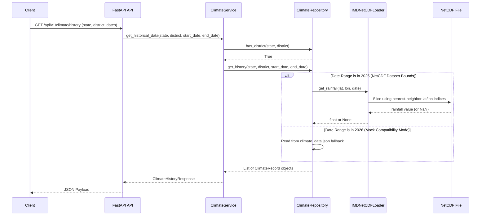

# IMD NetCDF Ingestion Pipeline

This document details the architecture and data flow for reading gridded daily rainfall observations from India Meteorological Department (IMD) NetCDF datasets.

---

## 1. NetCDF Dataset Structure

The default integrated dataset is `RF25_ind2025_rfp25.nc`, representing high-resolution daily rainfall observations across India for the year 2025.

### Coordinate Dimensions
- **TIME**: 365 days, encoded as `days since 1900-12-31`. Decoded into Python standard `datetime.date` objects (`2025-01-01` to `2025-12-31`).
- **LATITUDE**: 129 grid cells spaced at `0.25°` increments (6.5° N to 38.5° N).
- **LONGITUDE**: 135 grid cells spaced at `0.25°` increments (66.5° E to 100.0° E).

### Variables
- **RAINFALL**: shape `(TIME, LATITUDE, LONGITUDE)`. Unit: `mm/day`.
  - **FillValue**: `-999.0` (indicates areas outside India's land boundaries, such as oceans or neighboring countries).
  - NetCDF library parses masked values dynamically, which are decoded by `xarray` as `NaN`.

---

## 2. Ingestion Data Flow

The following sequence describes how a user request for rainfall history propagates through the architecture:

---

## 3. Component Responsibilities

### A. IMD NetCDF Loader (`IMDNetCDFLoader`)
- **Resource Management**: Opens and safely closes the raw NetCDF dataset using `xarray` with a `netcdf4` engine.
- **Coordinate Extraction**: Pre-loads and exposes coordinates (`LATITUDE`, `LONGITUDE`) and standardizes times to `datetime.date` objects.
- **Spatial Nearest-Neighbor Resolution**: Resolves arbitrary input lat/lon coordinates to the closest dataset grid coordinate within a strict tolerance window (0.25°).
- **Missing Value Handling**: Converts sea/ocean masked values (`-999.0` or `NaN`) to Python `None` to prevent numeric pollution in services.

### B. Climate Repository (`ClimateRepository`)
- **District Coordination**: Map administrative district queries (e.g. `Pune`, `Ratnagiri`) to their geographical center points (centroids) via `DISTRICT_COORDINATE_MAP` (to avoid heavy GIS dependencies during early phases).
- **Fallback Orchestrator**: Checks queried date boundaries. Routes queries in 2025 to the `IMDNetCDFLoader` and routes queries in 2026 to the legacy JSON database, assuring 100% backward-compatibility for API contract testing.
- **Data Model Transformer**: Map raw coordinate float values from the loader into strongly-typed `ClimateRecord` domain models.

---

## 4. Future Extensions

### A. Dynamic GIS Mapping
In subsequent sprints, instead of a static `DISTRICT_COORDINATE_MAP`, the repository will read district boundary polygons from simplified GeoJSON vector layers. Slicing will transition from centroid nearest-neighbor to point-in-polygon checks or spatial average aggregation over all grid points falling within the district boundary.

### B. Integrating Temperature & Other Grid Variables
When a temperature dataset (e.g., IMD daily temperature NetCDF) is introduced:
1. Instantiated as another loader (e.g. `IMDTemperatureLoader`) or unified inside `IMDNetCDFLoader`.
2. The `ClimateRepository` will query both loaders for `rainfall` and `temperature` variables respectively, merging the output into the final `ClimateRecord` domain model returned to the service layer.

### C. Satellite Data Integration (INSAT)
To support satellite land surface temperature (LST) or sea surface temperature (SST) feeds:
- Implement custom loaders under `app/pipeline/` inheriting from a base `GeospatialDataLoader` abstraction.
- Inject satellite data providers into the repository, applying similar temporal/spatial scaling parameters.
