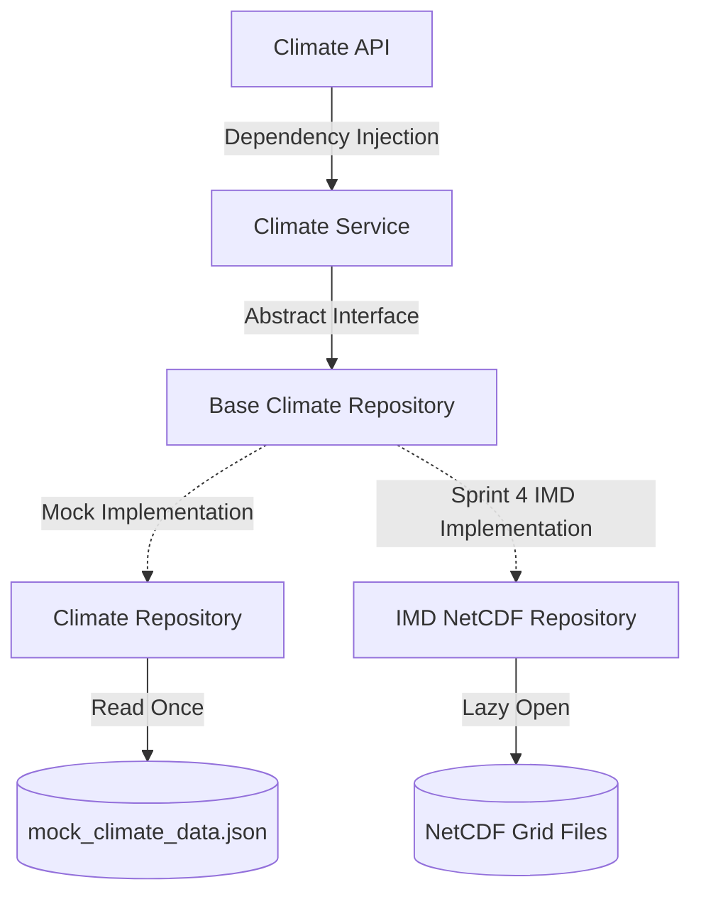

# PRITHVI Architecture: Repository Pattern for Swapable Data Sources

This document describes how the Repository Pattern decouples our data-access layer from the business logic and API routing layers in Project PRITHVI.

---

## The Layered Flow
Our architecture follows a strictly decoupled, unidirectional dependency chain:



### 1. Climate API Router (`app/api/climate.py`)
Exposes HTTP routes, handles serialization, and defines query/body validation rules. It depends solely on `ClimateService`.

### 2. Climate Service (`app/services/climate_service.py`)
Coordinates business rules (validation of location existence, handling empty outputs, mapping to contract schema shapes, raising custom domain exceptions). It depends solely on the abstract contract interface: `BaseClimateRepository`.

### 3. Base Climate Repository (`BaseClimateRepository` in `app/repositories/climate_repository.py`)
An abstract interface outlining required methods for retrieval.

---

## Swapability: Mock JSON to IMD NetCDF datasets

In Sprint 4, the mock JSON dataset will be replaced with real India Meteorological Department (IMD) gridded NetCDF datasets. Because of our clean abstraction, **we will only need to modify/replace the repository implementation.** No files in the API or Service layers will need to change.

### Step-by-Step Swap Process:

1. **Keep the Interface (`BaseClimateRepository`) Identical**:
   The methods `get_history(...)`, `get_current(...)`, and `has_district(...)` will retain their exact signatures and types (accepting Python datatypes like `str`, `date` and returning `ClimateRecord` domain models).

2. **Create the new IMD Repository**:
   Define `IMDClimateRepository(BaseClimateRepository)` under `app/repositories/climate_repository.py` (or as a separate module):
   ```python
   import xarray as xr
   from app.repositories import BaseClimateRepository
   
   class IMDClimateRepository(BaseClimateRepository):
       def __init__(self):
           # Lazy-load NetCDF datasets from settings.DATA_DIR / "raw" or "processed"
           self.temp_ds = xr.open_mfdataset(...)
           self.rain_ds = xr.open_mfdataset(...)

       def get_history(self, state: str, district: str, start_date: date, end_date: date) -> List[ClimateRecord]:
           # 1. Look up geographic bounding box or centroids for the district.
           # 2. Slice the netCDF dataset variables using the bounding coordinates and date bounds.
           # 3. Map the grid cells values into a List of ClimateRecord domain objects.
           # 4. Return the records list.
           pass
           
       def get_current(self, state: str, district: str) -> Optional[ClimateRecord]:
           # Slice the latest time index in netCDF and return as a ClimateRecord.
           pass

       def has_district(self, state: str, district: str) -> bool:
           # Check if district/state coordinates are within our spatial coverage database.
           pass
   ```

3. **Update Dependency Injection**:
   In `app/api/climate.py`, update `get_climate_repository()` to return the new instance:
   ```python
   def get_climate_repository() -> BaseClimateRepository:
       global _repo_instance
       if _repo_instance is None:
           _repo_instance = IMDClimateRepository()  # Replaces Mock ClimateRepository!
       return _repo_instance
   ```

Because FastAPI automatically handles dependency injection, this single swap instantly propagates to `ClimateService` and all routes, with **zero modifications** to business logic or routing endpoints.
